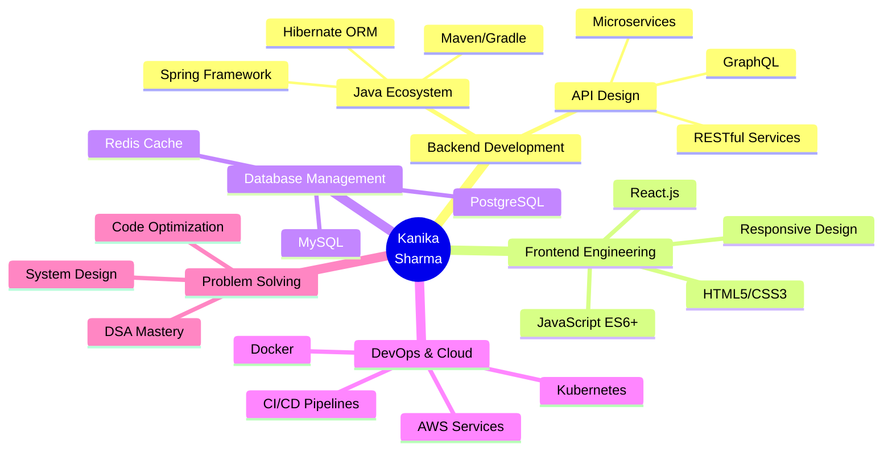

<!-- Advanced Header Design Option 4 - Shark Style -->
<div align="center">

<br>
<table align="center" border="0">
<tr>
<td align="center" width="300">
<br>
<b>Software Development Engineer</b><br>
<sub>J.P. Morgan Chase & Co.</sub>
</td>
<td align="center" width="300">
<br>
<b>Code for Good Winner 🏆</b><br>
<sub>2024 Champion</sub>
</td>
<td align="center" width="300">
<br>
<b>Fullstack Architect</b><br>
<sub>Java • React • Microservices</sub>
</td>
</tr>
</table>
</div>
## 🎯 MISSION CONTROL CENTER

<table align="center">
<tr>
<td width="50%" valign="top">

### 📡 CURRENT STATUS
```yaml
role: Software Development Engineer
company: J.P. Morgan Chase & Co.
location: Innovation Hub • Global Tech
focus: Java Fullstack Architecture
mission: Building scalable enterprise solutions
achievement: Code for Good 2024 Winner 🏆
status: [████████████████░░] 80% - Next Level Loading...
```

</td>
<td width="50%" valign="top">

### 💫 QUICK ACCESS
```javascript
const kanika = {
  code: ["Java", "JavaScript", "Python"],
  architecture: ["Microservices", "REST APIs", "MVC"],
  currentFocus: "Distributed Systems",
  challenge: "Optimizing @ Scale",
  funFact: "Coffee = Code² × Innovation"
};
```

</td>
</tr>
</table>

---

## 🛸 TECHNOLOGY MATRIX

<div align="center">

### ⚙️ CORE SYSTEMS

<table>
<tr>
<td align="center" width="150">

<br><strong>Java</strong>
<br><sub>Advanced</sub>
</td>
<td align="center" width="150">

<br><strong>Spring Boot</strong>
<br><sub>Expert</sub>
</td>
<td align="center" width="150">

<br><strong>React</strong>
<br><sub>Proficient</sub>
</td>
<td align="center" width="150">

<br><strong>JavaScript</strong>
<br><sub>Advanced</sub>
</td>
</tr>
</table>

### 🔧 DEVELOPMENT ARSENAL


</div>

---

## 📊 PERFORMANCE ANALYTICS

<div align="center">


</div>

<div align="center">

</div>

---

## 🎮 SKILL PROGRESSION TREE

<div align="center">



</div>

---


</div>

---

## 💡 INNOVATION LAB

<div align="center">

### 🔬 Current Experiments

```diff
+ Exploring: Reactive Programming with Spring WebFlux
+ Learning: Advanced System Design Patterns
+ Building: Scalable Microservices Architecture
! Optimizing: Database Query Performance
- Debugging: Legacy Code Modernization
```

### 📈 CODE FREQUENCY HEATMAP


</div>

---

## 🌐 NETWORK PROTOCOLS

<div align="center">

<a href="https://www.linkedin.com/in/kanika-sharma-100401249/">
  
</a>
<a href="mailto:kanikasharma1304@gmail.com">
  
</a>
<a href="https://github.com/Kanika0304">
  
</a>

<br><br>


</div>

---

## 📡 TRANSMISSION LOG

<div align="center">

```python
class Developer:
    def __init__(self):
        self.name = "Kanika Sharma"
        self.role = "Fullstack Engineer"
        self.language_spoken = ["Java", "JavaScript", "Python", "English", "Hindi"]
        self.code_philosophy = "Clean Code > Clever Code"
    
    def say_hi(self):
        print("Thanks for dropping by! Let's build something amazing together! 🚀")

me = Developer()
me.say_hi()
```

---

<div align="center">

### ⚡ *"First, solve the problem. Then, write the code."* ⚡


</div>

---

<div align="center">
<sub>💻 Crafted with passion and endless cups of coffee ☕ | Last Updated: 2025</sub>
</div>
