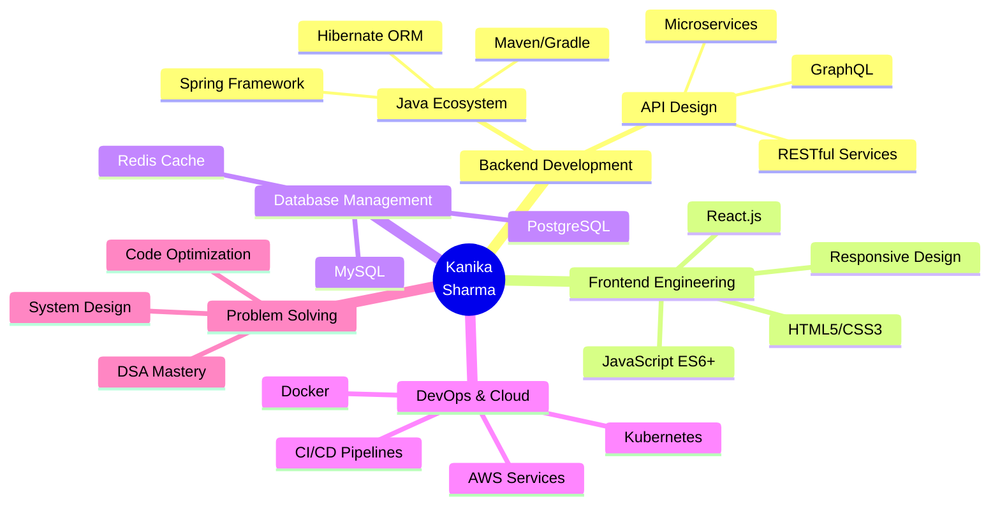

<div align="center">

<h1>
  
</h1>
<p align="center">
  
  
  
</p>
<p align="center">
  <a href="https://www.linkedin.com/in/kanika-sharma-100401249/">
    
  </a>
  <a href="mailto:kanikasharma1304@gmail.com">
    
  </a>
  <a href="https://github.com/Kanika0304">
    
  </a>
  
</p>

</div>

🎯 Mission Control Center
<div align="center">
<table>
<tr>
<td width="50%" align="center">
📡 CURRENT STATUS
<br>
<br>
<br>
<br>
<br>
<br><br>
Progress to Next Level
<br>
Show Image
</td>
<td width="50%" align="center">
💫 QUICK ACCESS
<br>
<br>
<br>
<br>
<br><br>
Developer Stats
<br>
☕ Coffee Consumed: ∞<br>
🐛 Bugs Fixed: 999+<br>
⭐ Solutions Built: 100+<br>
</td>
</tr>
</table>
</div>

## 🛸 TECHNOLOGY MATRIX

<div align="center">

### ⚙️ CORE SYSTEMS

<table>
<tr>
<td align="center" width="150">

<br><strong>Java</strong>
<br><sub>Advanced</sub>
</td>
<td align="center" width="150">

<br><strong>Spring Boot</strong>
<br><sub>Expert</sub>
</td>
<td align="center" width="150">

<br><strong>React</strong>
<br><sub>Proficient</sub>
</td>
<td align="center" width="150">

<br><strong>JavaScript</strong>
<br><sub>Advanced</sub>
</td>
<td align="center" width="150">

<br><strong>Python</strong>
<br><sub>Intermediate</sub>
</td>
</tr>
</table>

### 🔧 DEVELOPMENT ARSENAL


</div>

---

## 📊 PERFORMANCE ANALYTICS

<div align="center">


</div>

<div align="center">

</div>

---

## 🎮 SKILL PROGRESSION TREE

<div align="center">



</div>

---

## 🏆 ACHIEVEMENT VAULT

<div align="center">

| 🎖️ Recognition | 📅 Date | 🌟 Impact |
|:---:|:---:|:---:|
| **Code for Good Winner** | 2024 | Led team to build social impact solution |
| **SDE @ JPMorgan** | Current | Building enterprise-grade systems |
| **Fullstack Certification** | 2024 | Advanced Java & React specialization |


</div>

---

## 💡 INNOVATION LAB

<div align="center">

### 🔬 Current Experiments

```diff
+ Exploring: Reactive Programming with Spring WebFlux
+ Learning: Advanced System Design Patterns
+ Building: Scalable Microservices Architecture
! Optimizing: Database Query Performance
- Debugging: Legacy Code Modernization
```

### 📈 CODE FREQUENCY HEATMAP


</div>

---

## 🌐 NETWORK PROTOCOLS

<div align="center">

<a href="https://www.linkedin.com/in/kanika-sharma-100401249/">
  
</a>
<a href="mailto:kanikasharma1304@gmail.com">
  
</a>
<a href="https://github.com/Kanika0304">
  
</a>

<br><br>


</div>

---

## 📡 TRANSMISSION LOG

<div align="center">

```python
class Developer:
    def __init__(self):
        self.name = "Kanika Sharma"
        self.role = "Fullstack Engineer"
        self.language_spoken = ["Java", "JavaScript", "Python", "English", "Hindi"]
        self.code_philosophy = "Clean Code > Clever Code"
    
    def say_hi(self):
        print("Thanks for dropping by! Let's build something amazing together! 🚀")

me = Developer()
me.say_hi()
```

### 🎵 Currently Coding To

[](https://open.spotify.com/user/kanika0304)

</div>

---

<div align="center">

### ⚡ *"First, solve the problem. Then, write the code."* ⚡


</div>

---

<div align="center">
<sub>💻 Crafted with passion and endless cups of coffee ☕ | Last Updated: 2025</sub>
</div>
